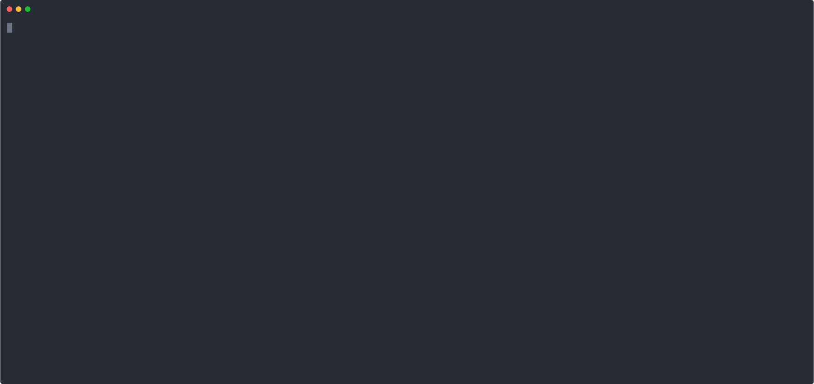

# TOOLING & Dependencies

Until now TTDB only works for Linux systems. 

##### GO (v1.20.2)
https://github.com/golang/go

##### ANTLR4 (v4.11.1)
https://github.com/antlr/antlr4

##### GO-PROMPT (v0.2.6)
https://github.com/c-bata/go-prompt

##### UUID (v1.3.0)
https://github.com/google/uuid

##### PGX - PostgreSQL Driver and Toolkit (v5.3.1)
https://github.com/jackc/pgx/
 
##### Neo4j Go Driver (v5.5.0)
https://github.com/neo4j/neo4j-go-driver

##### Decimal - Precise fixed point decimal numbers (v1.3.1)
https://github.com/shopspring/decimal
  
##### Yaml (v3.0.1)
https://github.com/go-yaml/yaml/tree/v3

##### OpenCypher (v9)
http://opencypher.org/resources/

##### Docker (v23.0.1)
https://github.com/docker

##### Docker Images

###### TimescaleDB Image 
timescale/timescaledb-ha (version: pg14-latest)

###### Neo4j Image 
neo4j (version: 5.2.0) 

##### Dockerize (v0.6.1)
https://github.com/jwilder/dockerize

##### Docker-Compose (v2.17.2)
https://github.com/docker/compose

##### Indirect dependencies
Note. It might be neccessary to install secondary dependencies. This should become apparent when trying to run TTDB in case they are missing.  

##### Scripts

All available scripts can bin found in the `/scripts` directory. For their functionality please refer to 
[environment setup](#environment-setup) and [testing](#testing). 

##### Github

Github is used for hosting the software: https://github.com/LexaTRex/timetravelDB


# HOW TO USE TimeTravelDB

## Environment Setup

To use TTDB it is necessary to start a docker environment providing a neo4j and a timescale database which TTDB utilizes to realise 
polyglot persistence for its data. There is no need to manually set up the containers since scripts are provided which can be executed
to setup the docker environment. In case there are issues manual setup is described as well. The database access information of the 
containers is stored and can be modified in `config.yaml`. By default the config is set to the credentials and ports used by the 
docker-compose setup in `docker-compose.yml` utilized by the scripts.  

### Clean Environment
To setup a clean testing environment with no data on the databases run the script `./scripts/setup_clean_environment.sh`

### Test Environment 
To setup a testing environment containing the data which is used for the integration tests (see [section testing](#testing)) run the script 
`./scripts/setup_testing_environment.sh`

### Manual Setup
The container settings for the environmental setup can be changed in `docker-compose.yml`. The environment can be manually started by
running `docker-compuse up`. Therefore possibly conflicting containers must be stopped beforehand. 

To run start the envionrment without docker-compose pull and run the following images as proposed


 run the neo4j docker image: 

`docker pull neo4j`

`docker run --publish=7474:7474 --publish=7687:7687 --volume=$HOME/neo4j/data:/data neo4j`

install and run the timescaledb docker image (see: https://docs.timescale.com/install/latest/installation-docker/): 

`docker pull timescale/timescaledb-ha:pg14-latest`

`docker run -d --name timescaledb -p 5432:5432 -e POSTGRES_PASSWORD=password timescale/timescaledb-ha:pg14-latest`


The `config.yaml` is to be adjusted according to the used ports and credentials. 


__Note__: If the neo4j docker container is not coming up remove it completely by `docker rm test_neo4j` and re-run the according script. 

### Backup & Restore 
For information on backing up and restoreing data of the containers please refer to [README_DOCKER.md](README_DOCKER.md). 

## Launching and Using TTQL CLI

### Build and Run Project under Development 
inside `/timetravelDB` run `go run main/main.go`

### Run Release  
run with `./TTDB`

### TTQL CLI Commands 
  

`hello`

prints "Hello, welcome to TTDB CLI !"

`quit`, `q`, `exit`, `Exit`, `Quit`, `EXIT`

exits TTDB 

`help`, `h`, `-h`, `--help`

prints helpful information for the usage of TTDB CLI

`<TTQL Query>`

run a passed `<TTQL query>` in the form of `FROM <DATETIME> TO <DATETIME> MATCH <PATTERN> WHERE <CONDITIONS> RETURN <RESULTSET>`

`Generate Data`, `GD`, `gd`

generates data according to the template `data-generator/graph_template.yaml` (see [Generating Data](#generating-data))

`Load Data`, `LD`, `ld`

loading generated data into the TTDB database (Neo4j and Timescaledb respectively)

`Load Data Neo4j`, `LDN`, `ldn`

loading generated data in Neo4j as in the manner of the only Neo4j solution. This is only used for comparing the solution of TTDB to 
an only Neo4j solution with the same data. The CLI cannot be used to query this data in a consistent way. If the data of the only
Neo4j solution is to be queried please refere to the common Neo4j query solutions, for example the Neo4j browser interface. By default
this is running on port [7474](http://localhost:7474), otherwise refere to `docker-compose.yml` or `docker ps`.  

`Clear Data`, `Clear DB`, `CD`, `cd`, `Clear TTDB`

clears all data from TTDB (Neo4j and TimescaleDB)

`Clear Neo4j`

clears only Neo4j 

`Debug=1`, `--debug=1`, `-debug=1`, `--debug=true`, `-debug=true`

enable debbuging output while running

`Debug=0`, `--debug=0`, `-debug=0`, `--debug=false`, `-debug=false`

disable debbuging output while running

`Benchmark`

run benchmarks	

note: if the program exits unexpectedly then sometimes the terminal settings are not restored correctly 
and the typed text is not visible anymore. To fix this issue type: `reset` in the terminal and hit enter
and restart the program

### Generating Data

To generate artificial data to test TTDB a data template can be defined in `data-generator/graph_template.yaml`. There a list of node
templates and a list of edge templates can be defined in the following way:

```
nodes:
  - labels: ["server"]
    count: 1 
    template:
      IP:
        "DataType": "string"
        Quantity: 1
      firewall:
        "DataType": "boolean"
        "Quantity": 3
      root:
        "DataType": "string"
        Quantity: 10
      Risc:
        "DataType": "int"
        "Quantity": 10 
      components: 
        cpu:
          "DataType": "string"
          "Quantity": 1
        ram:
          "DataType": "string"
          "Quantity": 1
edges:
  - label: "traffic"
    count: 3 
    from: "server"
    to: "server" 
    template:
      TCPUDP:
        "DataType": "string"
        "Quantity": 3 
      IPv4IPv6:
        "DataType": "string"
        "Quantity": 2 
      Risc:
        "DataType": "int"
        "Quantity": 5 
      Count:
        "DataType": "int"
        "Quantity": 4 
```

Every node has 1..n labels. then we define the amount of nodes which should be created according to this template. After template defines
the property template of the node. Each property holds either a nested property or two data pairs of the form `"DataType"` where we can set
the data type to `"string"`, `"int"`, or `"bool"` and "Quantity" where we define the amount of values which will be created for this property
label. In other word `"Quantity"` defines the length of the time series which is created for this property. 

For nodes the template works similar just that only a single label is allowed. Furthermore the fields `"from"` and `"to"` describe the node
type of the nodes the generated edges are randomly assigned to. In the example each generated edge has a node of type `"server"` as starting
and end point. This does not mean that it must be the same node. The rest works equal to the node template. 

Note that the generated data is randomly generated meaningless data and is used sloley for testing purposes and benchmarking purposes. 

# Developer Info

## Testing

Several tests are provided which support developing proccess. Most tests are unit tests and can be run using the standard go test envrionment.

## Tools  

In the following some useful information of the utilized tools are provided for developers. For a list of all the utilized tools refer to 
[tooling](#tooling-&-dependencies)

### ANTLR

Antlr not only can be used to generate a lexer, parser and listener templates. It can also be used for visualizing  parse 
trees for queries. This is very useful for debugging parser and lexer rules.   

### Neo4j 

To implement functionality for TTDB it is necessary to understand Neo4j and Cypher. Therefore consult 
[Cypher](https://neo4j.com/docs/cypher-manual/current/syntax/), 
[openCypher](https://opencypher.org) as well as the [neo4j docs](https://neo4j.com/docs/). 

To investigate the data in Neo4j use the common ways to query Neo4j data, for example the Neo4j browser interface. By default
this is running on port [7474](http://localhost:7474). Otherwise refer to `docker-compose.yml`. Data of Neo4j can be queried
using [Cypher](https://neo4j.com/docs/cypher-manual/current/syntax/) 

### TimescaleDB 

To implement functionality for TTDB it is necessary to understand TimescaleDB. Therfore consult 
[timescale docs](https://docs.timescale.com/) as well as 
[postgres docs](https://www.postgresql.org/docs/) (timescale uses postgres). 

To investigate the data in Timescaledb use the common ways to query TimescaleDB data, for example running psql in the docker container:
`docker exec -it test_timescaledb psql` when test_timescaledb is the TimescaleDB docker container. If not refer to `docker-compose.yml`  
or `docker ps` to refer to the container name. In the psql terminal PostgreSQL queries can be executed as well as an additional set
of psql terminal commands [psql](https://www.postgresql.org/docs/current/app-psql.html). 


## Debugging

For debugging a query type one of the following commands in the CLI before executing a query
`Debug=1`, `--debug=1`, `-debug=1`, `--debug=true`, `-debug=true` or manually set the DEBUG
variable in `/utils/helpers.go` to true. To disable debugging use 0/true instead. To include
permament debugging adhering to this, use the following syntax:
`Debug(a,b,c..)` which is equivalent to `log.Println(a,b,c..)`
`Debugf(str,a,b,c..)` which is equivalent to `log.Printf(str,a,b,c..)`
`Debugln(a,b,c..)` which prints a, b, c in an own line prefixed with some indent 


### Run Integration Tests

Be aware that running tests including a database setup (`TestDeepQueries`, `TestShallowQueries`)expect a clean setup with a restore 
of the test databases. If the tests are run manually make sure to clean up the shared volumes of the docker volumes before running the tests. This can be omitted when running  the script `run_integration_test.sh` in `scripts/`. Another option is to run `go test TestIntegration` which is an abstraction and calls the test script. This will trigger a cleanup and startup of the containers with freshly restored test-databases.

- `./scripts/run_integration_test.sh`
- `go test TestIntegration` 


## Developing Advise

TTDB is based on [openCypher](https://opencypher.org). Simplified the grammar is extended by the prefix `FROM DATETIME TO DATETIME SHALLOW?`. 
A lexer and a parser along with listener templates  are created with [ANTLR](https://www.antlr.org/). The listener templates in 
`parser/ttql_interface` are utilized by the listener implementation `/parser/listeners/ttql_listeners_impl.go` to
gather neccessary information to create the queries for binary querying while walking through the parse tree of a query. This happens in
`parser/parser.go`. From the collected information the  query processor builds the necessary queries for Neo4j and TimescaleDB in 
`/query-processor`. The query processor then sends the queries to the according databases via `/database-api` where the database access 
is managed via the according database drivers. The received results are forwarded back to the query processor which merges the results 
accordingly. 

Only a small subset of the functionality of openCypher is supported yet together with some additional functionalities which are 
time series focused. These not explicitly supported language features might result in unexpected behaviour. The supported features
can be seen in the list below. OpenCypher was used because of its depth and large variety of functionality with the idea to gradually
translate all features to apply to our binary database solution. To further develop TTDB features not openCypher features not realised
for TTDB can be developed as well as features which are not supported by openCypher at all. For the former the appropriate information
can be gathered extending the provided `/parser/listeners/ttql_listeners_impl.go`, calling the according templeate functions of the 
listener templates `/parser/ttql_interface`. For the latter TTQL itelf has to be extended/modified by changing the grammar in 
`parser/ttql_interface/TTQL.g4`. After modifying TTQL.g4 ANTLR has to be run again to generate a new parser, lexer and listener templates.    
For both cases rest of the implementation happens inside the `/query-processor`. Here the information gathered by the `ttql_listener_impl` 
is used to generate the according queries and assemble the database results. 

Note: it is essential to check if extending functionality compromise existing functionality

Furthermore during development it was realised that translating a powerful and extensive language like `opencypher` results in large 
overhead dealing with language constructs not even utilized yet. Some might never be utilized. This can be seen especially in the 
`ttql_listeners_impl.go` where it was necessary to loop through many unused language constructs. This raised the question if it wouldn't
be more constructive to throw out unused functionality of the grammar and building TTQL up as required than the other way around. Through
the gained insights it is expected that this would lead to better adapted code and functionality as well as cleaner and clearer code because
the requirements of TTQL and openCypher processing clearly diverge.   
  

To further develop TTDB take a look at grammar TTQL.g4. 

